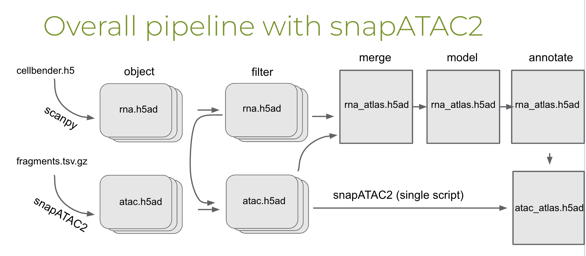
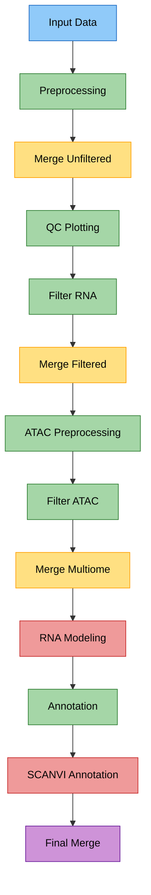
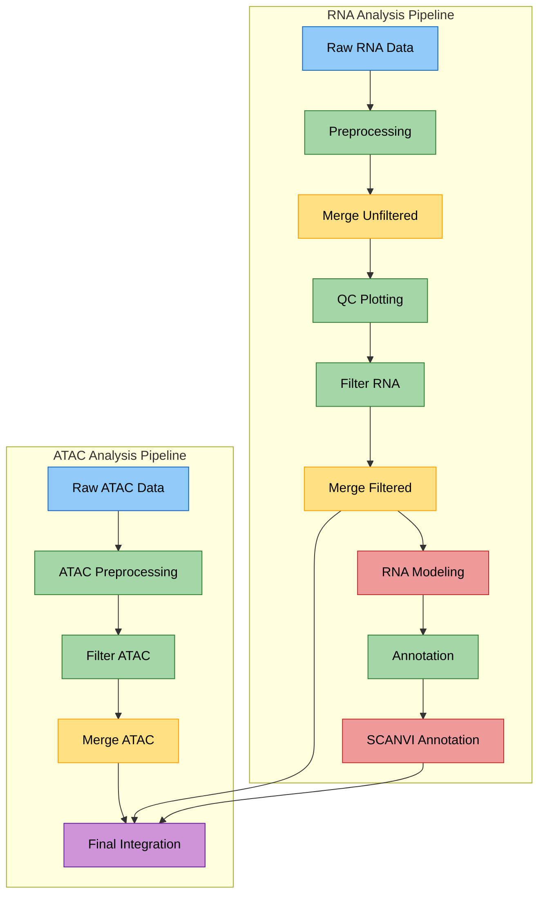
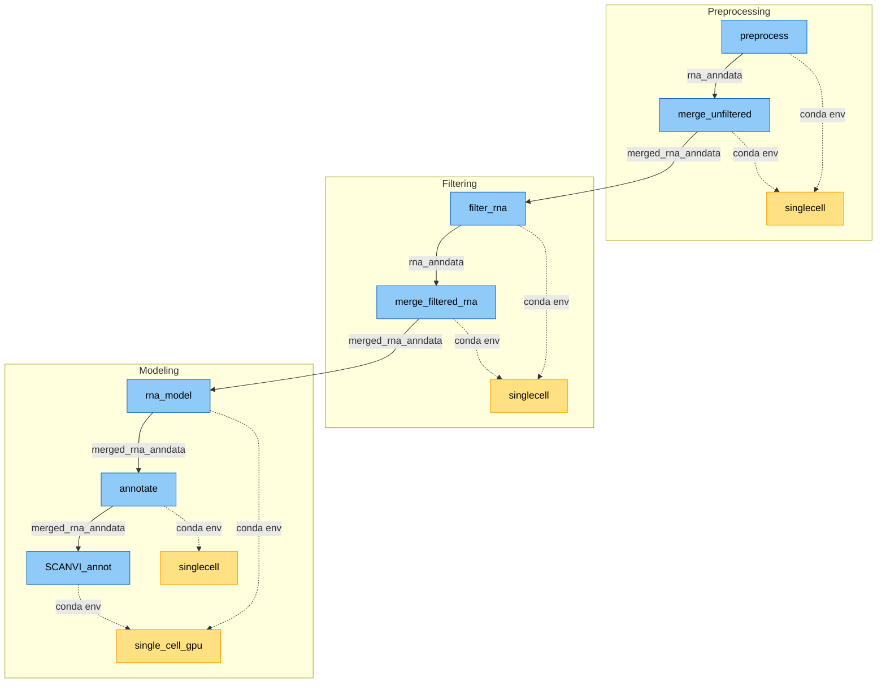

# multiome-pipeline

## Single-Nuclei Multiome Atlas Pipeline

This pipeline is built off of the Substantia Nigra single-nuclei atlas pipeline here (https://github.com/adamcatching/SN_atlas) and is being updated to be more interchangable between projects. Starting off the scripts and Snakemake pipeline work for the Substantia Nigra dataset.

The Substantia Nigra analysis pipeline was built to take several batches of human Substantia Nigra single-nuclei sequencing samples and process them into a multiome atlas object for further analysis. There are a currently number of hardcoded parameters such as the raw data paths and which cell type markers to be used for annotation. These should be modified for running this pipeline on a separate atlas, future plans are for making a more universal multiome pipeline with a single config file (see https://github.com/adamcatching/multiome-pipeline). The modules of Scanpy (https://github.com/scverse/scanpy), SCVI (https://github.com/scverse/scvi-tools), and snapATAC2 (https://github.com/kaizhang/SnapATAC2) are utilized heavily to produce a multiome atlas with minimal batch effects.

Current version:
- Uses Conda environments for each step; _this will be updated to singularity containers at a later point_.
- Snakemake forces the last step to run through the entire pipeline.
- Genes used for cell-typing are hard-coded into the Annotate rule; _this will be updated to a config file in the future_
- Both RNA and ATAC processing has to be done to run this pipeline; _in the future there will be a modular step to ignore ATAC or replace with other kinds of data (Methylation, proteomics, ...)_.
- Requires a metadata .csv file and all values within are saved in the atlas.
- Data needs to be stored in a specific heirarchy; _an intermediary folder for files will be implemented in the future_.
- Cellbender needs to be run after CellRanger; _once ambient RNA is corrected in future CellRanger-ARC this won't be necessary_.
- Differential Gene Expression and Differential Accessibility of Regions analysis are done in separate notebooks; _these may be integrated into a rule with differential parameters specified in the config file_.

## Pipeline

Once set up, this complete pipeline can be run by simply typing '''bash snakemake.sh ''' in terminal in an HPC running Slurm. This is a work in progress and has not been tested on other devices. 

### RNA processing

Transcriptomic data from CellRanger-ARC-2.0 ('''cellbender_gex_counts_filtered.h5''') is read in and processed with Scanpy. QC metrics of percent mitochondria/ribosomal RNA, doublet probability, and cell cycle.

### RNA QC

Parameters from the processing step are used to filter the cells from each samples based on percent mitochondrial transcripts, probability of being a doublet, and the minimum number of genes observed per cell.

### Individual RNA sample merging into atlas

Each individual RNA AnnData object are merged into a single QC-filtered object for downstream analysis.

### ATAC processing

ATAC fragment data is converted into an AnnData object with bins used as the measured variable in each cell. One object is created for each sample.

### ATAC QC

Cells in each sample's ATAC object are filtered for a minimum number of bins per cell. 

### Filtering RNA and ATAC data 

Each sample's QC-filtered RNA and ATAC AnnData objects are filtered for the same cells observed in both samples. Final AnnData objects are saved with a '''03_''' prefix.

### RNA modeling

Filtered RNA samples are merged into an atlas and multidimensional scaling is performed. A copy of the atlas is made with mitochondiral and ribosomal transcripts removed and only the most variable genes kept. SCVI is used to model the embed dimensions of the atlas, with batch correction, followed by KNN, leiden clustering, and UMAP scaling.

### Cell-typing

Cell types of the modeled and clustered RNA atlas are estimated using over-representation analysis and a currated list of cell gene markers.

### ATAC modeling

Using snapATAC2 for only read/write, both create a AnnDataSet object to run batch-corrected spectral analysis and scaling; resulting in a leiden-clustered UMAP AnnData object

### Merging to one multiome object
_in progress_
Both atlases are merged into a single muon AnnData object for portability.

# ~~~~~~~~~~~~~~~~~~~~~~~~~~~~~~~~~~~~~~~~~~~~~~~

# TESTING - FLOWCHART

### OVERVIEW

The colors in the diagram represent different types of operations:

- Blue: Input data
- Green: Processing steps
- Yellow: Merging operations
- Red: Machine learning/modeling steps
- Purple: Final integration steps

### DETAILED PROCESS FLOWS

### KEY RULE RELATIONSHIPS

Let's examine the relationships between specific rules:

- Solid lines show data flow between rules (e.g., rna_anndata flowing from preprocess to merge_unfiltered)
- Dotted lines indicate which conda environment each rule uses
- Each major processing stage (Preprocessing, Filtering, Modeling) forms a self-contained unit
- Rules share environments when performing related operations (e.g., both filtering rules use the singlecell environment)
